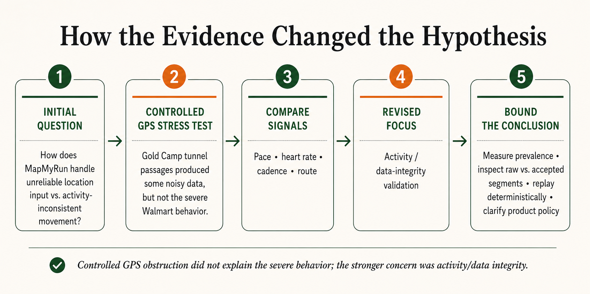

# MapMyRun Quality Investigation

**External black-box field assessment | August 22–23, 2026**

I spent a weekend testing MapMyRun on iPhone and Apple Watch after noticing something that made me question the integrity of a saved workout record.

The investigation started with real-world use, then moved into controlled field testing. The goal was not to hunt for bugs or prove a theory. It was to understand what the evidence actually supported, what it did not, and where I would investigate next with internal system access.

## How the evidence changed the hypothesis

The controlled tests showed that short GPS obstruction could create noisy data without producing the much more severe behavior seen in the vehicle-contaminated workouts. That shifted the focus toward the boundary between valid movement data and valid workout data.

## Assessment documents

### Quick read
**[Weekend Quality Assessment — 1 page](Michael_Jensen_MapMyRun_Weekend_Quality_Assessment.pdf)**

A concise summary of the field tests, observations, supported interpretation, and provisional risk.

### Full case study
**[Senior QE Assessment](Michael_Jensen_MapMyRun_Senior_QE_Assessment.pdf)**

Detailed test strategy, evidence, limitations, alternative explanations, findings, and recommended engineering follow-up.

## What I tested

The assessment included:

- iPhone- and Apple Watch-started workouts
- repeated tunnel passages on Gold Camp Road near Colorado Springs
- paired-phone and phone-off Watch scenarios
- real-world transitions between walking, driving, stopping, and walking again
- comparison of pace, route, heart rate, cadence, elevation, and saved workout behavior

## What I found

Two Run records containing known vehicle travel saved vehicle-scale movement as workout performance.

The controlled tunnel tests produced noisy instantaneous data at times, but all three saved walking workouts remained physically plausible. That made simple GPS obstruction a less convincing explanation for the much more severe vehicle-contamination behavior.

The strongest quality concern is therefore not that GPS can be noisy. It is that movement can be geographically valid while still being inconsistent with the activity the workout claims to represent.

## What I did not conclude

This was an external assessment, so I did not have access to source code, backend logs, raw GPS samples, internal requirements, production telemetry, or fleet-wide support data.

I do not claim to have identified a specific implementation defect, universal occurrence rate, or required product solution.

## Relationship to Other Portfolio Projects

This project is part of a six-project QA portfolio demonstrating complementary quality engineering skills:

| Project | Focus | Stack |
| --- | --- | --- |
| [pharmacy-spend-etl-qa](https://github.com/jensenmd/pharmacy-spend-etl-qa) | ETL pipeline validation, SQL-driven data integrity testing | Python / pytest / SQLite / pandas |
| [qa-automation-showcase](https://github.com/jensenmd/qa-automation-showcase) | REST API testing, data validation, CI/CD integration | Python / pytest / Postman / GitHub Actions |
| [restful-booker-qa](https://github.com/jensenmd/restful-booker-qa) | Full-stack layered testing — API + UI automation | Postman / Newman / Playwright / GitHub Actions |
| [ai-qa-framework](https://github.com/jensenmd/ai-qa-framework) | AI-assisted test generation, human-in-the-loop validation | Python / Claude API / pytest / GitHub Actions |
| [claude-code-qa-sessions](https://github.com/jensenmd/claude-code-qa-sessions) | Agentic QA analysis with human-reviewed recommendations | Claude Code / GitHub / QA analysis |
| **mapmyrun-quality-investigation** (this repo) | Black-box mobile/GPS QA investigation — field testing and evidence-bounded analysis | iPhone / Apple Watch / MapMyRun / field evidence |

Together they demonstrate data validation, API testing, UI automation, AI-assisted QA workflows, exploratory investigation, and evidence-driven quality engineering across multiple system layers.

## AI assistance

AI was used to accelerate research, test-design iteration, evidence normalization, and analysis.

Field execution, observation capture, evidence review, challenge of competing interpretations, and final conclusions remained human-owned.
