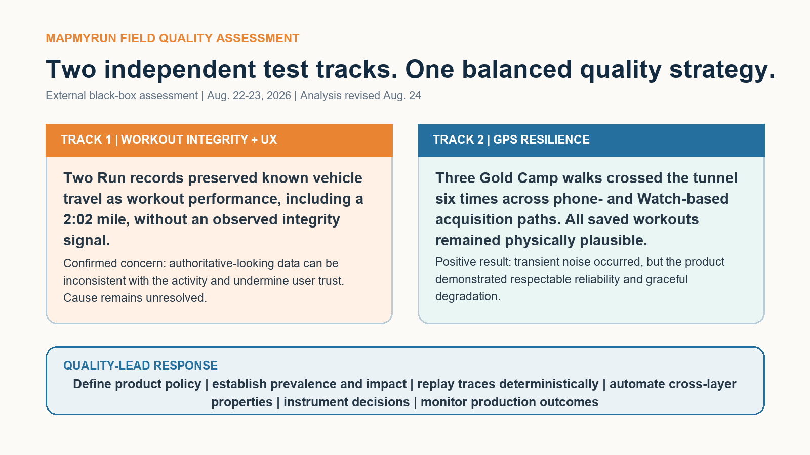

# MapMyRun Quality Investigation

External black-box field assessment | August 22-23, 2026 | Analysis revised August 24, 2026

I tested MapMyRun on iPhone and Apple Watch after encountering workout records that made me question the integrity and trustworthiness of saved performance data.

The assessment contains two independent test tracks. They are intentionally evaluated separately rather than presented as a single causal story.

## Track 1 - workout integrity and UX

Two Run records containing known vehicle travel saved vehicle-scale movement as workout performance. One included a 2:02 mile. The defensible concern is user trust: physically implausible performance was presented as authoritative workout data without an observed integrity signal or evaluated recovery path.

This external assessment does not identify the responsible component, establish population frequency, or claim a specific implementation defect.

## Track 2 - GPS-obstruction resilience

Three controlled Gold Camp Road walks crossed Tunnel #1 six times across iPhone-started, Watch-started, and phone-off acquisition paths. Some instantaneous traces were noisy, but all three saved workouts remained physically plausible.

That is a positive quality result. Under the tested conditions, MapMyRun demonstrated respectable reliability and graceful degradation.

## Assessment documents

- [Weekend Quality Assessment - one-page executive brief](Michael_Jensen_MapMyRun_Weekend_Quality_Assessment.pdf)
- [Quality Risk Assessment and Engineering Strategy - detailed case study](Michael_Jensen_MapMyRun_Senior_QE_Assessment.pdf)

## Quality-lead response

With internal access, I would turn the field evidence into a managed quality system:

- Establish prevalence, user impact, recovery behavior, and downstream propagation.
- Define product ownership and policy for activity-inconsistent movement.
- Capture and replay representative GPS traces and pedestrian-to-vehicle transitions deterministically.
- Validate raw samples, accepted segments, aggregates, UI, synchronization, and downstream consumers.
- Add activity-plausibility, internal-consistency, preservation, explainability, and idempotent-sync properties to automated regression coverage.
- Instrument privacy-appropriate acceptance decisions and monitor production outcomes by device, OS, app version, and workflow.
- Preserve the Gold Camp results as a positive resilience baseline.

## Field-test retrospective

The Gold Camp series also exposed a limitation in my own protocol: the three paths were very similar, but not controlled tightly enough to attribute small distance differences to the app. If I repeated the work, I would synchronize clocks and start each trial at the top of a minute; mark identical start, turnaround, and end points; predefine variables and acceptance criteria; repeat each condition; use a field checklist or voice timestamps; and log every route deviation immediately.

That limitation reduces causal confidence around the distance variance. It does not erase the positive result that all three workouts saved successfully and remained plausible. The lesson is to preserve uncertainty, improve the protocol, and run the next experiment with tighter controls.

## Evidence boundaries

The assessment used field notes, saved workout summaries, route maps, split tables, and analysis screens. It did not use source code, backend logs, raw GPS samples, internal requirements, controlled location replay, production telemetry, or fleet-wide support data.

## Revision note

After publication, I reviewed the analysis again and concluded that the original narrative connected the independently designed Gold Camp and vehicle-transition test tracks too closely. This revision separates their evidence boundaries, reports the positive resilience result directly, and expands the quality-management and automation strategy. Raw observations were not changed.

## AI assistance

AI accelerated background research, test-design iteration, evidence normalization, challenge of competing interpretations, and document production. I executed the field tests, captured observations, reviewed the evidence, corrected the narrative, and retained ownership of the final conclusions.
