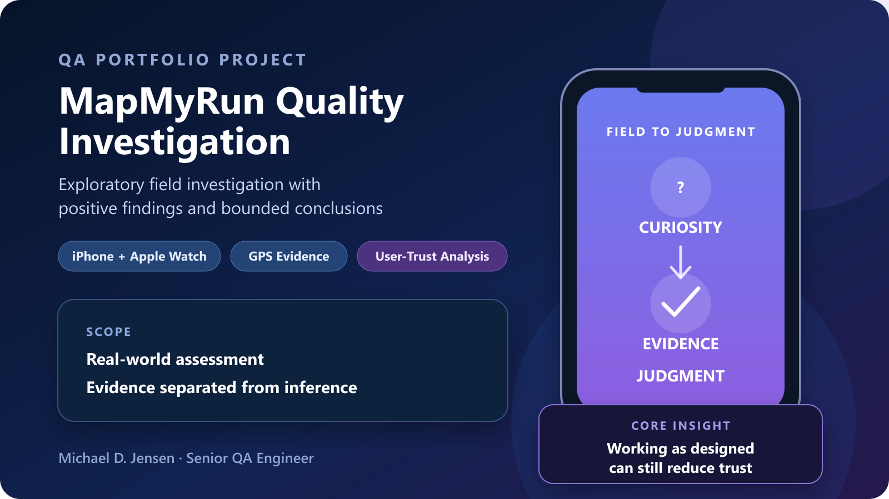
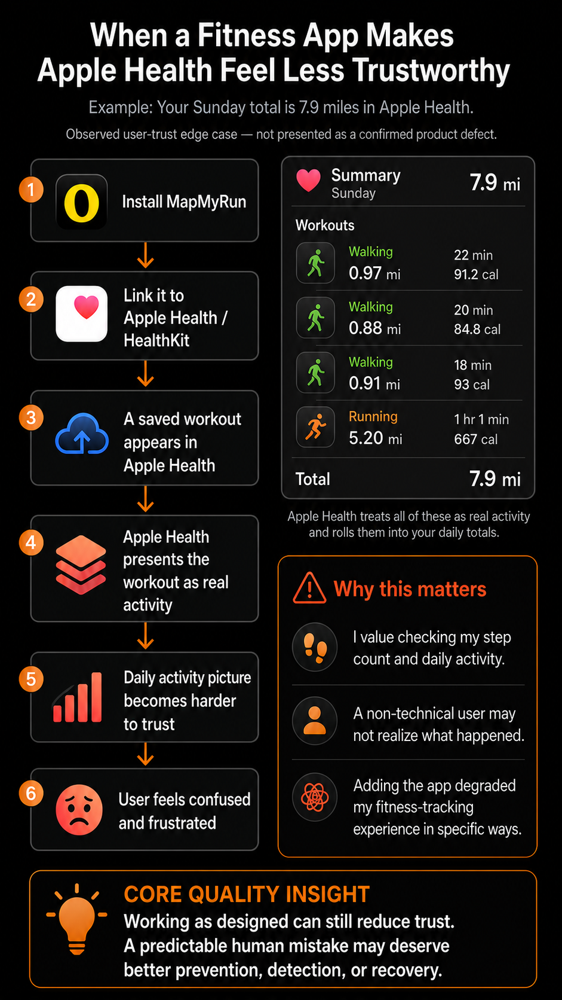

# MapMyRun Quality Investigation

Exploratory mobile field investigation with positive findings, a reproducible user-trust concern, and deliberately bounded conclusions.

Built by **Michael D. Jensen** — Senior QA Engineer with 15+ years of enterprise testing experience and a practical focus on risk, evidence, and how real users experience quality.

🔗 [LinkedIn](https://www.linkedin.com/in/michaeljensen-qa/) | 📧 jensen.md@gmail.com

---

## What This Project Demonstrates

| Quality skill | Evidence in this investigation |
|---|---|
| Exploratory judgment | Turned ordinary use into a focused follow-up experiment without forcing the evidence toward a predetermined answer |
| Mobile field testing | Exercised iPhone, Apple Watch, GPS obstruction, phone availability, and pedestrian-to-vehicle transitions |
| Evidence discipline | Kept the Gold Camp resilience tests separate from the walk-to-drive records and separated observation from inference |
| Product-quality thinking | Evaluated a predictable human mistake through prevention, detection, recovery, and user-trust tradeoffs |
| Honest technical communication | Reported positive results, limitations, competing explanations, and next questions without claiming an unproven defect |

This is not a source-code audit or a claim that MapMyRun is broken. It is an external black-box investigation showing how I move from curiosity to evidence to judgment when product behavior and user experience do not align cleanly.

---

## Why This Investigation?

While applying for a QA Automation Engineer role supporting the MapMyFitness app suite, I was asked to identify important current quality issues. Rather than speculate, I installed MapMyRun, used it as a new customer, and timeboxed a weekend field investigation.

I began with no defect hypothesis and expected the app to perform well. It did: the controlled GPS-obstruction tests produced plausible saved workouts under every tested condition. A separate, accidental walk-to-drive transition exposed a different question—not whether the software violated a known requirement, but whether a predictable user mistake can create authoritative-looking activity data that reduces trust downstream.

---

## Investigation at a Glance

### 1. Accidental observation

During ordinary use, I forgot to end a Run session before driving. The saved workout included vehicle travel and a physically implausible 2:02 mile. That observation became the basis for a deliberate follow-up—not a conclusion about root cause.

### 2. Focused reproduction

The next morning, I exercised a similar pedestrian-to-vehicle transition during a walk to Walmart. A second saved Run record again included known vehicle travel. The behavior was consistent with the documented expectation that the user must end the workout.

### 3. Independent resilience tests

Later that morning, I ran three separate Gold Camp Road scenarios across the same tunnel route:

1. iPhone-started and carried, with Apple Watch worn.
2. Apple Watch-started, with the powered-on iPhone left at the start.
3. Apple Watch-started, with the iPhone powered off and left at the start.

Each route began in open air, crossed Tunnel #1, continued beyond it, reversed, crossed back, and ended after returning to open air. All three workouts saved successfully and remained physically plausible.

---

## What the Evidence Showed

### Positive finding: graceful degradation

The Gold Camp series produced some expected instantaneous GPS noise, but no catastrophic route corruption or impossible saved workout. Under the tested conditions, MapMyRun handled obstruction and changing device availability with respectable resilience.

### User-trust concern: authoritative-looking bad data

The two walk-to-drive records preserved known vehicle movement as Run performance. I later observed the resulting activity contributing to a trusted Apple Health activity view. The exact synchronization timing, responsible component, broader frequency, and downstream treatment remain outside the evidence.

---

## Core Quality Insight

> **MapMyRun may have behaved exactly as designed. The quality question is whether a predictable human mistake deserves better prevention, detection, or recovery—balanced against false positives, accessibility, privacy, battery use, and implementation cost.**

That distinction matters. “Working as designed” answers a requirements question; it does not automatically settle the product-quality question. A guardrail might improve trust, but an aggressive one could interrupt legitimate users, misclassify unusual workouts, consume battery, or create accessibility problems. The right response begins with evidence about prevalence and impact—not a reflexive fix.

---

## What Was Not Concluded

This investigation does **not** establish:

- a MapMyRun implementation defect;
- the responsible component or data owner;
- population frequency or production severity;
- exact Apple Health synchronization timing or transformation behavior;
- whether Outside has already evaluated or intentionally accepted this tradeoff; or
- the optimal product response.

Those boundaries are part of the work, not disclaimers added afterward.

---

## What I Would Investigate Next

With product and engineering access, I would:

- establish prevalence, user impact, recovery behavior, and downstream propagation;
- review requirements, support signals, product policy, and prior decisions before proposing changes;
- capture and replay pedestrian-to-vehicle transitions and GPS-obstruction traces deterministically;
- compare prevention, detection, warning, correction, and recovery options against false-positive, accessibility, privacy, battery, and implementation costs;
- validate behavior across the raw samples, accepted segments, saved workout, UI, synchronization, and downstream consumers; and
- preserve the Gold Camp results as a positive resilience baseline.

---

## Assessment Documents

- [Weekend Quality Assessment — executive brief](Michael_Jensen_MapMyRun_Weekend_Quality_Assessment.pdf)
- [Quality Risk Assessment and Engineering Strategy — detailed case study](Michael_Jensen_MapMyRun_Senior_QE_Assessment.pdf)

---

## How the Interpretation Evolved

The first published narrative connected the vehicle-transition and Gold Camp tracks too tightly. I caught that overreach, returned to the evidence, and revised the assessment so the independent test designs and conclusions were explicit. A later review sharpened the framing again: the strongest finding was not “MapMyRun failed,” but that documented behavior can still create a legitimate user-trust question.

The raw observations did not change. The interpretation improved as uncertainty was challenged. That is the investigation’s most important process result: revise the story when the evidence demands it.

---

## AI Assistance

AI accelerated background research, test-design iteration, evidence organization, challenge of competing interpretations, visual production, and document drafting. I executed the field tests, captured the observations, corrected unsupported connections, and retained ownership of the final judgments and evidence boundaries.

---

## QA Portfolio Quick Reference

This project is part of a broader portfolio demonstrating complementary quality-engineering skills.

| Project | Focus |
|---|---|
| [android-appium-wdio-poc](https://github.com/jensenmd/android-appium-wdio-poc) | Native Android UI automation proof of concept using Appium, WebdriverIO, TypeScript, and UiAutomator2 |
| [mapmyrun-quality-investigation](https://github.com/jensenmd/mapmyrun-quality-investigation) **(this repository)** | Black-box mobile and GPS investigation using field evidence, product judgment, and bounded conclusions |
| [restful-booker-qa](https://github.com/jensenmd/restful-booker-qa) | Layered API and UI automation using Postman, Newman, Playwright, and GitHub Actions |
| [pharmacy-spend-etl-qa](https://github.com/jensenmd/pharmacy-spend-etl-qa) | ETL pipeline and SQL-driven data-integrity validation modeled after healthcare analytics work |
| [qa-automation-showcase](https://github.com/jensenmd/qa-automation-showcase) | REST API testing, data validation, and CI/CD-integrated automation |
| [ai-qa-framework](https://github.com/jensenmd/ai-qa-framework) | Human-reviewed AI-assisted test generation with structured cases and pytest execution |
| [claude-code-qa-sessions](https://github.com/jensenmd/claude-code-qa-sessions) | Agentic analysis of existing QA repositories with human review and targeted implementation |
| [agentqa-orchestrator](https://github.com/jensenmd/agentqa-orchestrator) | Structured agentic code auditing using Python, Pydantic, Gemini, and JSON |

---

## Author

**Michael D. Jensen** — Senior QA Engineer 
15+ years of enterprise software testing experience across healthcare IT, financial systems, telecommunications, and cybersecurity. Deep background in REST API validation, SQL-based data integrity verification, exploratory testing, and quality ownership in complex systems.

Current hands-on work includes Python/pytest automation, Playwright and Appium projects, CI/CD-integrated quality practices, and practical AI-assisted QA workflows.

🔗 [LinkedIn](https://www.linkedin.com/in/michaeljensen-qa/) | 🐙 [GitHub Profile](https://github.com/jensenmd) | 📧 jensen.md@gmail.com
